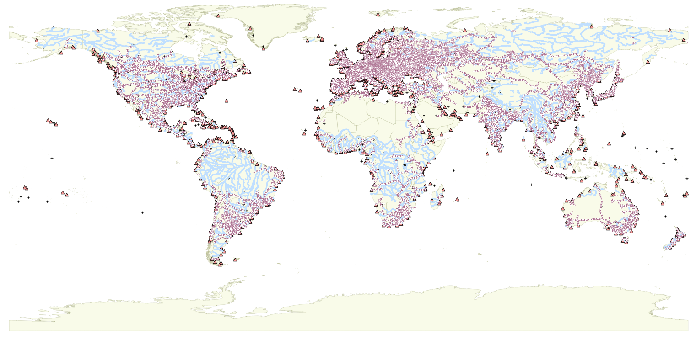

# Description des données

## Aperçu des données



## Airports 

### Description 

### Symbolisation 


### sql

```sql
SET CLIENT_ENCODING TO UTF8;
SET STANDARD_CONFORMING_STRINGS TO ON;
BEGIN;
CREATE TABLE "airports" (gid serial,
"scalerank" int2,
"featurecla" varchar(80),
"type" varchar(50),
"name" varchar(200),
"abbrev" varchar(4),
"location" varchar(50),
"gps_code" varchar(254),
"iata_code" varchar(254),
"wikipedia" varchar(254),
"natlscale" float8);
ALTER TABLE "airports" ADD PRIMARY KEY (gid);
SELECT AddGeometryColumn('','airports','geom','4326','POINT',2);
COMMIT;
```

## Ports 

### Description 

### Symbolisation 


### sql

```sql
SET CLIENT_ENCODING TO UTF8;
SET STANDARD_CONFORMING_STRINGS TO ON;
BEGIN;
CREATE TABLE "ports" (gid serial,
"scalerank" int2,
"featurecla" varchar(80),
"name" varchar(50),
"website" varchar(254),
"natlscale" float8);
ALTER TABLE "ports" ADD PRIMARY KEY (gid);
SELECT AddGeometryColumn('','ports','geom','4326','POINT',2);
COMMIT;
```
 
## Railroads 

### Description 

### Symbolisation 


 
### sql 
 
```sql
SET CLIENT_ENCODING TO UTF8;
SET STANDARD_CONFORMING_STRINGS TO ON;
BEGIN;
CREATE TABLE "railroads" (gid serial,
"rwdb_rr_id" int4,
"mult_track" int2,
"electric" int2,
"other_code" int2,
"category" int2,
"disp_scale" varchar(5),
"add" int2,
"featurecla" varchar(50),
"scalerank" int2,
"natlscale" float8,
"part" varchar(50),
"continent" varchar(50));
ALTER TABLE "railroads" ADD PRIMARY KEY (gid);
SELECT AddGeometryColumn('','railroads','geom','4326','MULTILINESTRING',2);
COMMIT;
``` 

## Lakes 

### Description 

### Symbolisation 


### sql
 
```sql
SET CLIENT_ENCODING TO UTF8;
SET STANDARD_CONFORMING_STRINGS TO ON;
BEGIN;
CREATE TABLE "lakes" (gid serial,
"featurecla" varchar(32),
"scalerank" numeric(10,0),
"name" varchar(254),
"name_abb" varchar(25),
"name_alt" varchar(254),
"note" varchar(100),
"delta" varchar(100),
"dam_name" varchar(254),
"year" int4,
"admin" varchar(50));
ALTER TABLE "lakes" ADD PRIMARY KEY (gid);
SELECT AddGeometryColumn('','lakes','geom','4326','MULTIPOLYGON',2);
COMMIT;
```
 
## Rivers 

### Description 

### Symbolisation 


### sql

```sql
SET CLIENT_ENCODING TO UTF8;
SET STANDARD_CONFORMING_STRINGS TO ON;
BEGIN;
CREATE TABLE "rivers" (gid serial,
"dissolve" varchar(100),
"scalerank" numeric,
"featurecla" varchar(32),
"name" varchar(254),
"name_alt" varchar(254),
"rivernum" numeric(10,0),
"note" varchar(200));
ALTER TABLE "rivers" ADD PRIMARY KEY (gid);
SELECT AddGeometryColumn('','rivers','geom','4326','MULTILINESTRING',2);
COMMIT;
```

## Retour au cours 

[Cours](cours.md)
